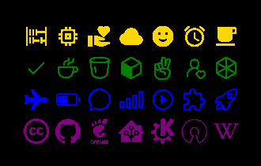

# 📦 embedded-icon

[](https://github.com/patrickelectric/embedded-icon/actions/workflows/doc.yml)
[](https://crates.io/crates/embedded_icon)
[](https://patrickelectric.work/embedded-icon/embedded_icon/index.html)

12600+ 🖼 icons for embedded-graphics.

<p align="center">
  
</p>

# 🚀 Features
- 📦 Support to multiple icon packs - Easy to add support to!
- 🎨 Multiple resolutions - 12px to 144px
- ⚡ Zero cost abstraction - Only enabled icons increase binary size

## 💾 Installation
Add this to your `Cargo.toml`:

```toml
[dependencies]
embedded-icon = "0.0.1"
```

## 🎨 Icon Packs
- [Material Design Icons](https://pictogrammers.com/library/mdi/)
- [Ionicons](https://ionic.io/ionicons/)
- [Simple Icons](https://simpleicons.org/)
- [Iconoir](https://iconoir.com/)

## 🖼 Usage
```rs
use embedded_graphics::image::Image;
use embedded_graphics::pixelcolor::Rgb888;
use embedded_graphics::prelude::*;
use embedded_icon::{simple::size32px::Github};

let github_icon = Github::new(Rgb888::CSS_ORANGE);
Image::new(github_icon, Point::new(10, 10)).draw(display).ok();
```

Check the example: `cargo run --example simple`
## 🤝 Contributing
Contributions are welcome! Please open an issue or PR on GitHub.

This project was inspired by [embedded-iconoir](https://github.com/Yandrik/embedded-iconoir).
